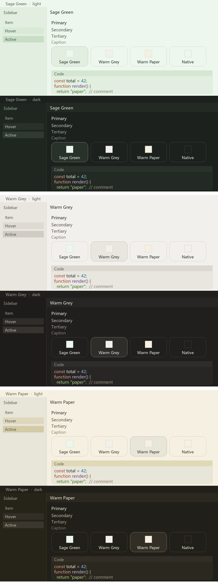

# Eye-care palettes

[中文](README.md) ｜ **English**

> Three low-glare colour schemes that repaint the **DeepSeek Harness** UI — Warm Paper, Sage Green and Warm Grey.
> Switch between them in **Settings → General**; the choice applies instantly and is remembered.



That image is the real thing — the colours are the ones the themes actually use.

## The three palettes

| Theme | Base | Raised | Accent | Character |
| --- | --- | --- | --- | --- |
| **Warm Paper** | `#f5f0e1` | `#e8e5d9` | `#e0d9b7` | Cream paper, warm — easiest on the eyes in daylight (default) |
| **Sage Green** | `#eef7ed` | `#e2efe0` | `#4f765f` | Pale green base, the calmest for long reading sessions |
| **Warm Grey** | `#f2f0ec` | `#e9e6e0` | `#dcd8cf` | A neutral warm grey that stays out of the way |

All three are light-first. Switch to dark mode and each turns into its own night face
(warm night brown / deep sage night / warm grey night), so you never end up with a light
base and dark borders.

## Install

**Desktop app**: open **Add plugin**, pick the **npm registry** as the source, enter
`@xiaotuchu/dsh-theme-eye-care`, and install. Restart once when it asks.

**Command line** (`web` / headless profiles; on the Desktop app use `desktop` instead of `web`):

**From npm**

```powershell
dsh plugin --profile web add "@xiaotuchu/dsh-theme-eye-care"
```

**From GitHub**

```powershell
dsh plugin --profile web add "git+https://github.com/xiaotuchu/dsh-theme-eye-care.git"
```

**From a local directory**

```powershell
dsh plugin --profile web add "C:\path\to\dsh-theme-eye-care"
```

**Restart DSH once** after installing. After that, switching palettes needs no restart.

## Switching

- **Where**: Settings → General, right after the built-in Appearance and Font size rows.
- **Four options**: Warm Paper, Sage Green, Warm Grey, plus **Native**. Choosing Native drops
  this plugin's tint and hands the UI back to your own light/dark theme.
- **Look**: cube buttons, the same visual rules as the built-in Appearance row — only laid out
  at equal width so all four fit on one line.
- **Instant**: one click and it is applied; no restart, no refresh.
- **Remembered**: it is still your choice next time you open the app.
- **Multi-window**: switch in one window and the others follow.
- **Follows the language**: the copy follows Settings → General → Language. In Chinese this row
  reads 背景色 / 暖纸 / 豆绿 / 暖灰 / 原生.

## Measured contrast

| Theme | Mode | Primary | Secondary | Tertiary | Caption | Link |
| --- | --- | --- | --- | --- | --- | --- |
| Warm Paper | Light | 10.93 / 9.86 | 6.36 / 5.74 | 5.30 / 4.78 | 3.29 / 2.97 | 5.24 |
| Warm Paper | Dark | 13.11 / 10.75 | 8.59 / 7.04 | 6.09 / 4.99 | 3.69 / 3.03 | 8.32 |
| Sage Green | Light | 12.05 / 11.10 | 6.68 / 6.16 | 5.49 / 5.06 | 3.44 / 3.17 | 4.69 |
| Sage Green | Dark | 13.13 / 10.65 | 8.82 / 7.15 | 6.16 / 5.00 | 4.56 / 3.70 | 7.95 |
| Warm Grey | Light | 11.90 / 10.88 | 6.85 / 6.26 | 5.78 / 5.28 | 3.75 / 3.43 | 4.94 |
| Warm Grey | Dark | 13.19 / 11.02 | 8.39 / 7.01 | 5.72 / 4.78 | 4.18 / 3.50 | 7.38 |

Each cell is "on the base / on the raised surface" contrast (`:1`). Floors: primary ≥9,
secondary ≥5.5, tertiary ≥4.5, caption ≥2.5, link ≥4.5.

## Uninstall

```powershell
dsh plugin --profile web remove @xiaotuchu/dsh-theme-eye-care
```

This plugin never touches a file that ships with DSH. Uninstalling puts your original theme
back immediately.

## Known limits

- **The first install needs one DSH restart**; the client plugin roster is assembled at startup.
- A handful of places in the UI are painted with hard-coded colours by third-party components;
  a theme cannot override those (nothing in DSH itself does this).
- Your choice is stored in browser local storage, **keyed by origin (host + port)**: the desktop
  build pins its port, so it survives restarts; opening the web profile on a different port counts
  as a new origin and falls back to the default palette.
- Only colours that already exist in DSH are overridden — no new variables are invented. If a
  future DSH release introduces new colour variables, those places keep the official palette.
  This plugin is built and tested against DSH `0.2.0-rc.2`.

## License

MIT © 2026 Xiaotu — see [LICENSE](LICENSE).
Repository: <https://github.com/xiaotuchu/dsh-theme-eye-care>
