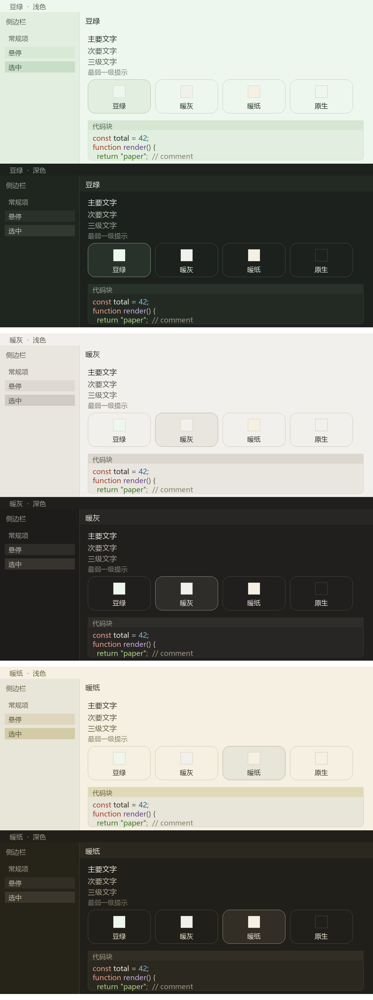

# 护眼配色 Eye-care palettes

**中文** ｜ [English](README.en.md)

> 三套低刺激配色，给 **DeepSeek Harness** 的界面换底色 —— 暖纸、豆绿、暖灰。
> 在**设置 → 通用**里一键切换，选完立刻生效并被记住。



上图就是三套配色的真实效果，色值取的就是实际用的颜色。

## 三套配色

| 主题 | 主底 | 抬升面 | 强调 | 气质 |
| --- | --- | --- | --- | --- |
| **暖纸** | `#f5f0e1` | `#e8e5d9` | `#e0d9b7` | 米黄底，偏暖，白天最耐看（默认） |
| **豆绿** | `#eef7ed` | `#e2efe0` | `#4f765f` | 淡绿底，长时间读代码最省眼 |
| **暖灰** | `#f2f0ec` | `#e9e6e0` | `#dcd8cf` | 中性偏暖，颜色最不抢戏 |

三套都以浅色为主。切到深色模式时会自动换成同色系的**夜版**（暖夜褐 / 深绿夜 / 暖灰夜），
不会出现浅色底配深色边框那种错配。

## 安装

**桌面版应用**：打开**「添加插件」**，安装源选 **npm 官方源**，填 `@xiaotuchu/dsh-theme-eye-care`，安装。装完按提示重启一次。

**命令行**（`web` / headless 等 profile；桌面版命令行则把 `web` 换成 `desktop`）：

**从 npm**

```powershell
dsh plugin --profile web add "@xiaotuchu/dsh-theme-eye-care"
```

**从 GitHub**

```powershell
dsh plugin --profile web add "git+https://github.com/xiaotuchu/dsh-theme-eye-care.git"
```

**从本地目录**

```powershell
dsh plugin --profile web add "C:\path\to\dsh-theme-eye-care"
```

装完**需要重启一次 DSH**，之后切换配色就不用再重启了。

## 切换

- **位置**：设置 → 通用，紧跟在内置的「外观」和「字号」两行之后。
- **四个选项**：暖纸、豆绿、暖灰，外加一个 **原生**。选「原生」会撤掉本插件的底色，
  回到你原本的深浅色主题。
- **样子**：方块按钮，和内置「外观」那行是同一套视觉规则——只是改成等宽排布，四个方块刚好排满一行。
- **立即生效**：点一下当场换，不需要重启或刷新。
- **会被记住**：下次打开还是这一套。
- **多窗口同步**：另一个窗口切换时，本窗口跟着换。
- **跟随语言**：文案跟着 设置 → 通用 → 语言 走。切成英文时这一行显示为 Background、Sage Green、Warm Grey、Warm Paper、Native。

## 对比度实测

| 主题 | 模式 | 主要文字 | 次要文字 | 三级文字 | 最弱提示 | 链接 |
| --- | --- | --- | --- | --- | --- | --- |
| 暖纸 | 浅色 | 10.93 / 9.86 | 6.36 / 5.74 | 5.30 / 4.78 | 3.29 / 2.97 | 5.24 |
| 暖纸 | 深色 | 13.11 / 10.75 | 8.59 / 7.04 | 6.09 / 4.99 | 3.69 / 3.03 | 8.32 |
| 豆绿 | 浅色 | 12.05 / 11.10 | 6.68 / 6.16 | 5.49 / 5.06 | 3.44 / 3.17 | 4.69 |
| 豆绿 | 深色 | 13.13 / 10.65 | 8.82 / 7.15 | 6.16 / 5.00 | 4.56 / 3.70 | 7.95 |
| 暖灰 | 浅色 | 11.90 / 10.88 | 6.85 / 6.26 | 5.78 / 5.28 | 3.75 / 3.43 | 4.94 |
| 暖灰 | 深色 | 13.19 / 11.02 | 8.39 / 7.01 | 5.72 / 4.78 | 4.18 / 3.50 | 7.38 |

每格是「在底色上 / 在抬升面上」的对比度（`:1`）。门槛：主要文字 ≥9、次要 ≥5.5、三级 ≥4.5、
最弱提示 ≥2.5、链接 ≥4.5。

## 卸载

```powershell
dsh plugin --profile web remove @xiaotuchu/dsh-theme-eye-care
```

本插件不改动 DSH 自带的任何文件。卸载后界面立刻回到你原本的主题。

## 已知边界

- **首次安装要重启一次 DSH**，插件名册在启动时组装。
- 界面里有极少数位置如果被第三方组件用写死的颜色覆盖，主题就盖不过去（DSH 自带组件没有这种情况）。
- 你选的配色存在浏览器本地存储里，**按来源（域名 + 端口）区分**：桌面版端口固定，所以重启后仍保留；
  换成别的端口开 web 版会被当成一个新来源，回到默认配色。
- 只覆盖 DSH 官方已经存在的颜色变量，不新增变量。DSH 大版本升级如果引入了新的颜色变量，
  那些位置仍是官方配色——本插件按 DSH `0.2.0-rc.2` 制作并测试。

## 许可

MIT © 2026 Xiaotu — 见 [LICENSE](LICENSE)。
仓库：<https://github.com/xiaotuchu/dsh-theme-eye-care>
